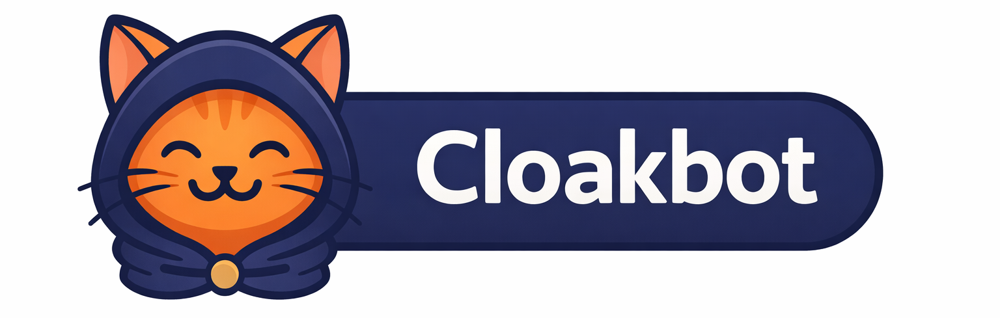

<p align="center">
  
</p>

<h1 align="center">Cloakbot：隐私保护 AI Agent</h1>

<p align="center">在你的数据与任意远端 LLM 之间，加一层本地多智能体隐私防护。</p>

<p align="center">
  
  
  
  
  
  
  
</p>

<p align="center"><a href="README.md">English</a> | <strong>简体中文</strong></p>

<p align="center"><sub>基于 <a href="https://github.com/HKUDS/nanobot">nanobot</a> 构建 · 已提交至 <strong>Gemma 4 Good Hackathon</strong>（Kaggle，2026 年 5 月）</sub></p>

CloakBot 在会话与远端 LLM 之间加入一条**本地隐私流水线**。消息发往上游之前，会先经过由受信任本地模型（通过 vLLM/Ollama 提供）驱动的多智能体系统，执行两类仅输出 JSON 的本地检测：一类识别通用敏感实体，另一类识别敏感数字与时间信息。命中的文本片段会被替换为可逆、带类型的占位符，并保存到会话级 Vault。遇到数学任务时，远端 LLM 只负责给出结构，真实计算在本地基于 Vault 原值完成。

远端 LLM 返回后，CloakBot 会在本地恢复占位符，并追加每轮隐私报告。流式输出会先缓冲，等后处理结束再展示，避免用户看到未恢复的占位符。

---

## 目录

- [工作流程](#工作流程)
- [检测范围](#检测范围)
- [多智能体系统设计](#多智能体系统设计)
- [项目结构](#项目结构)
- [路线图](#路线图)
- [安装与启动](#安装与启动)
- [运行测试](#运行测试)
- [关键设计取舍](#关键设计取舍)
- [Hackathon 赛道](#hackathon-赛道)
- [致谢与许可证](#致谢与许可证)

---

## 工作流程

```
用户消息
  └─► [pre_llm_hook → PrivacyOrchestrator]
        • 本地通过 vLLM 运行 GeneralPrivacyDetector + DigitPrivacyDetector
        • 将敏感片段替换为带类型 token  例如 "Alice" → <<PERSON_1>>
        • 持久化会话 Vault（token ↔ 原文映射，以及必要时的数值）
        • 在本地做意图分类（chat / math / doc）
        • 将当前轮路由给 ChatAgent 或 MathAgent
  └─► [远端 LLM — Claude / GPT / Gemini]
        • 只接收脱敏后的提示词
        • math 任务会附加额外约束，要求输出 <python_snippet_N> 代码块
        • 响应中继续使用占位符，不直接暴露原始值
  └─► [post_llm_hook → 本地后处理]
        • 用 Vault 中的真实值执行仅算术的数学代码片段
        • 将 <<PERSON_1>> 恢复为 "Alice"
        • 生成每轮隐私报告
  └─► 用户最终看到的是已恢复原值的回复
```

---

## 检测范围

| 类别 | 示例 | 默认等级 |
|---|---|---|
| 个人与联系方式 | 姓名、手机号、邮箱、住址 | High |
| 唯一身份与隐私标识 | 身份证号、护照号、账号、车牌 | High |
| 密钥与访问凭据 | 密码、API Key、私有令牌、敏感 URL | High |
| 组织与网络上下文 | 公司名、学校名、IP 地址 | High |
| 医疗与私密叙事信息 | PHI、治疗信息、机密计划、代号等敏感文本 | High |
| 敏感数字与时间信息 | 金额、日期、百分比、计数、测量值、分数、坐标 | High |

检测器拆分为两条本地流程：`GeneralPrivacyDetector` 负责不可计算的文本实体，`DigitPrivacyDetector` 负责后续可能参与本地计算的数字/时间实体。内置注册表当前将已支持的实体家族统一标为 `high`。

### Token 规则

所有实体都按 `<<ENTITY_TYPE_INDEX>>` 格式替换，读起来直观、规则一致：

| 原始值 | Token | 等级 |
|---|---|---|
| `Alice Chen` | `<<PERSON_1>>` | High |
| `alice@acme.com` | `<<EMAIL_1>>` | High |
| `555-123-4567` | `<<PHONE_1>>` | High |
| `123-45-6789` | `<<ID_1>>` | High |
| `$142,500` | `<<FINANCE_1>>` | High |
| `December 15, 2026` | `<<DATE_1>>` | High |
| `15%` | `<<PERCENTAGE_1>>` | High |
| `Stanford Hospital` | `<<ORG_1>>` | High |
| `Metformin 500mg` | `<<MEDICAL_1>>` | High |

索引按实体类型独立递增。这样远端 LLM 仍能区分关系（例如 `PERSON_1` 和 `PERSON_2` 是两个人），但不知道具体是谁。

---

## 多智能体系统设计

CloakBot 在隐私层内部采用**混合多智能体架构**：本地 Orchestrator 负责围绕远端 LLM 调用，协调检测、路由、聊天与数学处理。远端 LLM 被视作不受信任的计算资源，只能接触脱敏文本。

### 信任边界

```
┌─────────────────────────────────────────────────────────────────────┐
│                        LOCAL TRUST ZONE                             │
│                                                                     │
│   User ──► [ pre_llm_hook ]                                         │
│                  │                                                  │
│                  ▼                                                  │
│         [ PrivacyOrchestrator ]                                     │
│            /         |         \                                    │
│           ▼          ▼          ▼                                   │
│  [PiiDetector] [IntentAnalyzer] [TurnContext/Vault]                 │
│      /    \             │             │                             │
│     ▼      ▼            ▼             ▼                             │
│ [General] [Digit]   [TaskRouter]   [Handler]                        │
│    via      via        /   \           │                            │
│  Gemma 4  Gemma 4     ▼     ▼          ▼                            │
│   vLLM     vLLM   [Chat] [Math]   [Session Vault]                   │
│                          │        (JSON-backed placeholder map)     │
│                          ▼                                          │
│                 [Local Math Executor]                               │
│                                                                     │
└──────────────────┬──────────────────────────────────────────────────┘
                   │  sanitized payload only
   ────────────────┼──────────── REMOTE BOUNDARY ─────────────────────
                   ▼
            [ Remote LLM ]  (Claude / GPT / Gemini APIs)
                   │
   ────────────────┼─────────────────────────────────────────────────
                   │  response re-enters local trust zone
                   ▼
┌──────────────────────────────────────────────────────────────────────┐
│                    POST-RESPONSE LOCAL PIPELINE                      │
│                                                                      │
│   [ MathAgent ]      ← executes <python_snippet_N> blocks locally    │
│           │                                                          │
│   [ Restorer ]       ← swap tokens back using Vault                  │
│           │                                                          │
│   [ Transparency Report ]  ← summarize masked input/tool entities    │
│           │                                                          │
└───────────┼──────────────────────────────────────────────────────────┘
            ▼
         Output → User ✓
```

路由器里已经有 `Intent.DOC`，但还没有 `DocAgent`。文档类请求目前会回退到 `ChatAgent`。

### Agent 列表

| Agent | 职责 | 模型 |
|---|---|---|
| **PrivacyOrchestrator** | 协调单轮全流程：脱敏、意图识别、路由、恢复、报告 | Python orchestrator |
| **PiiDetector** | 并行运行 general/digit 检测后做去重整合 | Gemma 4 via vLLM |
| **GeneralPrivacyDetector** | 抽取姓名、ID、密钥、组织名等不可计算敏感片段 | Gemma 4 via vLLM |
| **DigitPrivacyDetector** | 抽取敏感数字/时间片段，并为后续本地计算规范化 | Gemma 4 via vLLM |
| **IntentAnalyzer** | 将请求分类为 `chat`、`math`、`doc` | Gemma 4 via vLLM |
| **Handler + Vault** | 应用 `<<TAG_N>>` 占位符并持久化会话映射 | 规则引擎 + JSON 文件 |
| **ChatAgent** | 将脱敏文本发往上游，响应在恢复前保持原样 | 规则引擎 |
| **MathAgent** | 远端调用前注入代码片段约束，调用后本地执行受限代码 | 远端 LLM + 本地执行器 |
| **Restorer** | 通过单次正则扫描恢复占位符 | 规则引擎 |
| **Transparency Report** | 生成每轮隐私报告（Markdown） | 规则引擎 |
| **Tool Interceptor** | 预留给未来的工具输出约束，目前是占位文件 | 暂未实现 |

### 检测分层（纵深防御）

当前运行时**强制执行 1 次远端调用前检测**：

```
Pass 1  用户输入        → 防止原始 PII 离开设备
Pass 2  LLM 响应        → 规划中，尚未接线
Pass 3  工具调用输出    → helper 已有，interceptor 尚未接线
```

代码里已经有 `sanitize_tool_output()` 和 `tool_output_entities`，扩展点在；目前真正落地的是输入侧脱敏 + 响应后恢复 + 本地数学执行。

### 数学隐私（Goal 2）

在计算场景下，远端 LLM 只负责“推理结构”，不会拿到真实数值：

```
输入:   "My salary is $142,500. What is 18% of it?"
脱敏:   "What is 18% of <<FINANCE_1>>?" + snippet contract
远端:   "<python_snippet_1>result = FINANCE_1 * 0.18</python_snippet_1>"
本地:   result = 142500 * 0.18          # 用 Vault 原值替换后执行
输出:   "$25,650.00"
```

本地执行器刻意收窄能力：以 Python AST 解析，只允许给 `result` 赋值的算术表达式；仅暴露少量安全函数（`abs`、`round`、`min`、`max`、`pow`）；未知变量或链式幂运算都会拒绝。

### 文档与数据集隐私（Goal 3）

这一部分 README 先于代码实现。目前**还没有**完整的文档/数据集隐私流水线。

当前已有：
1. 意图分析能识别 `doc`。
2. 路由层能保留该意图。
3. `get_agent()` 会告警并回退到 `ChatAgent`，因为 `DocAgent` 尚未实现。

所以文档隐私目前仍是路线图项，不是现有功能。

### 工具调用隐私（Goal 4）

工具隐私目前也是**部分打桩**状态：

```
已实现:
  sanitize_tool_output(text, session_key)  → 可复用 helper
  TurnContext.tool_output_entities         → 报告数据位

未接线:
  agents/tool_interceptor.py               → 占位
  主工具循环中的 pass 3 强制执行            → 待实现
```

也就是说，工具结果脱敏的核心入口已经有了，但主循环还没有对所有工具输出统一执行这一层。

---

## 项目结构

```
cloakbot/
├── cloakbot/
│   ├── privacy/                 ← CloakBot 隐私层
│   │   ├── core/
│   │   │   ├── detection/
│   │   │   │   ├── detector.py      General + digit 检测入口
│   │   │   │   ├── general_detector.py  本地 vLLM 非可计算实体抽取
│   │   │   │   ├── digit_detector.py    本地 vLLM 数字/时间实体抽取
│   │   │   │   └── llm_json.py      本地模型 JSON 完成辅助
│   │   │   ├── sanitization/
│   │   │   │   ├── sanitize.py      对外脱敏/恢复接口
│   │   │   │   ├── handler.py       占位符替换逻辑
│   │   │   │   ├── restorer.py      占位符恢复
│   │   │   │   └── alias_resolver.py  跨轮复用占位符
│   │   │   ├── math/
│   │   │   │   ├── math_executor.py 远端代码约束 + 本地执行
│   │   │   │   └── math_helpers.py  算术 AST 安全校验
│   │   │   └── state/
│   │   │       └── vault.py         会话级 token/value 持久化
│   │   ├── agents/
│   │   │   ├── runtime/
│   │   │   │   ├── orchestrator.py  隐私总控
│   │   │   │   ├── task_router.py   chat/math/doc 路由
│   │   │   │   └── registry.py      worker 注册与发现
│   │   │   ├── classification/
│   │   │   │   └── intent_analyzer.py   本地意图分析
│   │   │   └── workers/
│   │   │       ├── chat_agent.py    标准脱敏聊天流程
│   │   │       └── math_agent.py    远端生成、本地执行数学片段
│   │   ├── hooks/
│   │   │   ├── pre_llm.py           远端调用前脱敏
│   │   │   ├── post_llm.py          远端调用后恢复
│   │   │   └── context.py           单轮隐私上下文
│   │   └── transparency/
│   │       └── report.py            每轮隐私报告渲染
│   ├── providers/
│   │   └── vllm.py                  OpenAI 兼容客户端 → 受信任 vLLM
│   └── agent/
│       └── loop.py                  脱敏中间件（2 个 hook）
├── tests/
│   ├── privacy/                     隐私层单元测试
│   └── sanitizer/                   旧版 sanitizer 兼容/集成测试
└── scripts/
    └── start_vllm.sh                启动 vLLM 服务
```

会话级占位符映射会以 JSON 形式存到 `~/.cloakbot/sanitizer_maps/`，同一会话跨轮可复用。CloakBot 现在已支持**多轮会话隐私保护**：占位符映射可跨轮延续，同时对用户展示仍在本地恢复。可计算占位符还会保存规范化数值，用于后续本地数学执行。

---

## 路线图

### ✅ v0.1 — 隐私运行时基础（当前，2026 年 4 月）
- [x] general 与 numeric/temporal 双检测器拆分
- [x] 使用 `<<ENTITY_TYPE_N>>` 占位符脱敏
- [x] JSON 持久化会话 Vault
- [x] 最终输出占位符恢复
- [x] Web UI 聊天界面
- [x] 带单轮上下文的 PrivacyOrchestrator
- [x] 本地意图分析与 chat/math/doc 路由
- [x] MathAgent 代码片段约束 + 本地算术执行
- [x] 多轮会话隐私保护
- [x] Web UI 易用性优化

### 🔨 v0.2 — 信任边界扩展
- [ ] 工具调用检测器：在主循环强制执行工具输出脱敏
- [ ] 完整版 `ToolInterceptor` 实现
- [ ] `DocAgent` 正式实现
- [ ] 文档分块-映射-聚合流程（共享 Vault）
- [ ] 面向数据集的 schema/列级脱敏

### 🚀 v0.3 — 生产可用增强
- [ ] Vault 持久化加密选项
- [ ] 更快检测路径/更小本地模型
- [ ] 更好的双语与准标识符覆盖
- [ ] 超越当前注册表默认策略的策略化处理
- [ ] 完整端到端隐私集成测试

---

## 安装与启动

### 1. 克隆并安装

```bash
git clone https://github.com/spire-studio/cloakbot.git && cd cloakbot
uv sync
```

### 2. 配置

```bash
cp .env.example .env
# 编辑 .env:
#   VLLM_BASE_URL=http://<your-vllm-server>:8000/v1
#   VLLM_API_KEY=your-secret-token
#   VLLM_MODEL=google/gemma-4-E2B-it
```

按 CloakBot 常规方式（或使用 `onboard`）在 `~/.cloakbot/config.json` 中配置远端 LLM（Claude、GPT、Gemini 等）：

```bash
uv run python -m cloakbot onboard
```

### 3. 启动 vLLM 服务（Ubuntu / GPU 机器）

```bash
# 首次使用：安装 vllm 并登录 HuggingFace
uv sync --extra vllm
uv run huggingface-cli login          # 在 hf.co/google/gemma-4-E2B-it 接受 Gemma 协议

# 启动服务（会自动读取 .env 里的 VLLM_API_KEY 与 VLLM_MODEL）
bash scripts/start_vllm.sh
```

> vLLM 服务提供 OpenAI 兼容 API。CloakBot 的 sanitizer 只把它用于本地 PII 检测；远端 LLM 调用链路是分离的。

### 4. 启动 WebUI

```bash
uv run python -m cloakbot webui
```

---

## 关键设计取舍

**脱敏 + Token 化，而不是伪名化**：`<<PERSON_1>>` 比“替换成假人名”更直接也更稳妥。远端 LLM 仍能理解 `PERSON_1` 与 `PERSON_2` 的关系，但拿不到真实身份。

**双检测器、单 Vault**：将不可计算文本与数字/时间实体拆开处理，既保留任务结构，又能在本地保留后续数学执行所需的规范化数据。

**数学场景中远端只做推理**：数学任务要求远端输出 `<python_snippet_N>` 结构，最终数值结果始终在本地结合 Vault 原值计算。

**默认 fail-open**：当本地 vLLM 不可用时，默认透传消息而非阻断对话；同时 sanitizer API 也支持严格 fail-closed。

**面向流式输出的安全后处理**：CLI 会先缓冲流式内容，等数学执行、占位符恢复与报告生成完成后再输出，避免中间态泄露。

**基于 hook 的低侵入集成**：隐私层主要代码集中在 `cloakbot/privacy/`，通过 [loop.py](/Users/laurieluo/Documents/github/my-repos/cloakbot/cloakbot/agent/loop.py:574) 中的 `pre_llm_hook` / `post_llm_hook` 接入主运行时。

**路线图能力已预埋骨架**：文档意图、工具输出脱敏 helper、tool interceptor 占位文件都已在代码中，但尚未全部接入运行时。

---

## Hackathon 赛道

- **主赛道**：Gemma 4 Good（使用 Gemma 4 做本地隐私保护）
- **Ollama 特别赛道**：本地模型推理（vLLM，兼容 Ollama API）

---

## 致谢与许可证

CloakBot 基于 HKUDS 的 [nanobot](https://github.com/HKUDS/nanobot)（MIT License）构建。频道接入、会话管理、记忆系统和 CLI 来自上游框架。本仓库中 CloakBot 的隐私相关实现主要位于 `cloakbot/privacy/`、[vllm.py](/Users/laurieluo/Documents/github/my-repos/cloakbot/cloakbot/providers/vllm.py:1)，以及 [loop.py](/Users/laurieluo/Documents/github/my-repos/cloakbot/cloakbot/agent/loop.py:574) 的 hook 接入点。
